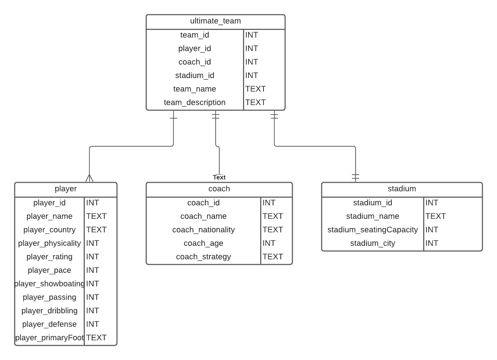

# Ultimate-team-API

## General Approach: 
My goal here is to create a Ultimate Team API. I want to create a full application with a js form for a frontend that allowed users to sumbit form data on a webpage. This form data will then be sent to my database with API calls and finallay displayed again on the webpage. I also want to implement users so that each users is able manipulate their Teams. Finally, my last goal is to create a way for users to play pit their teams against other user Teams.

## My Entity Relationship Diagram (ERD):

## User Stories
- As a user, I should be able to create a team or multiple teams
- As a user, I should be able to give my team(s) a name and description
- As a user, I should be able to create a player for my team
- As a user, I should be able to create many players for a team
- As a user, I should have access to CRUD methods for my player(s) and team(s)
- As a user, I should be able to create a coach
- As a user, I should not be able to create more than one coach per team
- As a user, I should have access to CRUD methods for my coach(es)
- As a user, I should be able to create a stadium
- As a user, I should not be able to create more than one stadium per team
- As a user, I should have access to CRUD methods for my stadium(s)

## Endpoints

### Team Endpoints
| ENDPOINT | FUNCTIONALITY | ACCESS |
| --- | :--- | :--- |
| POST _/api/teams_ | Create a Team | PUBLIC |
| PUT _/api/teams/{teamId}_ | Update a Team| PUBLIC |
| GET _/api/teams_ | Get All Teams | PUBLIC |
| GET _/api/teams/{teamId}_ | Get A Team | PUBLIC |
| DELETE _/api/teams/{teamId}_ | DELETE A Team | PUBLIC |

### Player Endpoints
| ENDPOINT | FUNCTIONALITY | ACCESS |
| --- | :--- | :--- |
| POST _/api/teams/{teamId}/players_ | Create a Player | PUBLIC |
| PUT _/api/teams/{teamId}/players/{playerId}_  | Update a Player| PUBLIC |
| GET _/api/teams/{teamId}/players_  | Get All Player | PUBLIC |
| GET _/api/teams/{teamId}/players/{playerId}_  | Get A Player | PUBLIC |
| DELETE _/api/teams/{teamId}/players/{playerId}_  | DELETE A Player | PUBLIC |

### Coach Endpoints
| ENDPOINT | FUNCTIONALITY | ACCESS |
| --- | :--- | :--- |
| POST _/api/teams/{teamId}/coaches_ | Create a Coach | PUBLIC |
| PUT _/api/teams/{teamId}/coaches/{coachId}_ | Update a Coach| PUBLIC |
| GET _/api/teams/{teamId}/coaches_ | Get All Coach | PUBLIC |
| GET _/api/teams/{teamId}/coaches/{coachId}_ | Get A Coach | PUBLIC |
| DELETE _/api/teams/{teamId}/coaches/{coachId}_ | DELETE A Coach | PUBLIC |

### Stadium Endpoints
| ENDPOINT | FUNCTIONALITY | ACCESS |
| --- | :--- | :--- |
| POST _/api/teams/{teamId}/stadiums_ | Create a Stadium | PUBLIC |
| PUT _/api/teams/{teamId}/stadiums/{stadiumId}_ | Update a Stadium| PUBLIC |
| GET _/api/teams/{teamId}/stadiums_ | Get All Stadium | PUBLIC |
| GET _/api/teams/{teamId}/stadiums/{stadiumId}_ | Get A Stadium | PUBLIC |
| DELETE _/api/teams/{teamId}/stadiums/{stadiumId}_ | DELETE A Stadium | PUBLIC |

## Technology used:

- Java
- Spring
- PostgreSQL
- Lucid for ERD
- Postman for testing endpoints
- Vanilla Javascript, CSS and HTML

## Challenges:
I encountered a few issues implemetning users

