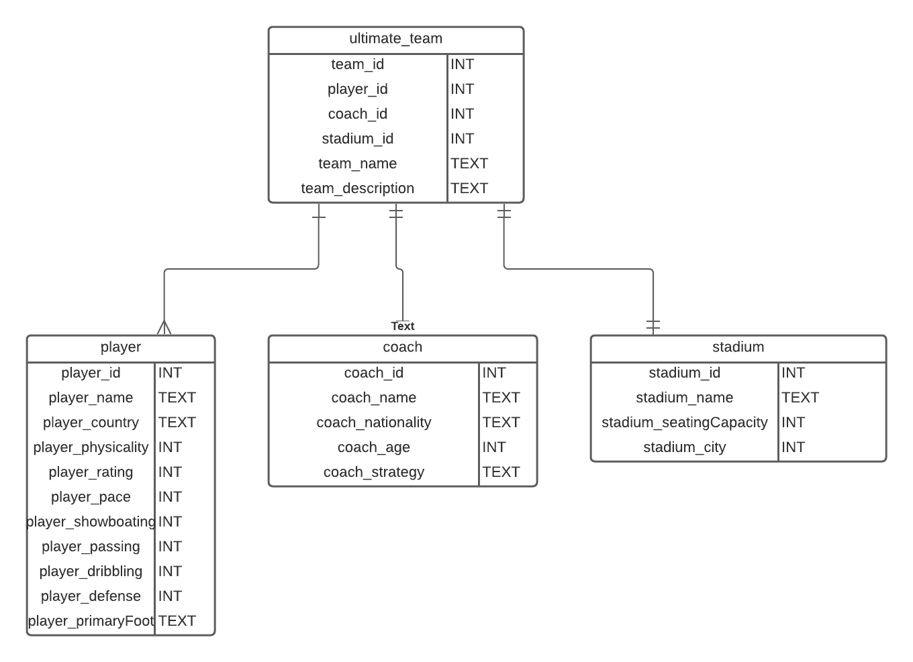

# Ultimate-team-API

## General Approach: 

## My Entity Relationship Diagram (ERD):

## User Stories
- As a user, I should be able to start a new tic tac toe game
- As a user, I should be able to click on a square to add X first and then O, and so on
- As a user, I should be shown a message after each turn for if I win, lose, tie
- As a user, I should not be able to click the same square twice
- As a user, I should be shown a message when I win, lose or tie
- As a user, I should not be able to continue playing once I win, lose, or tie
- As a user, I should be able to play the game again without refreshing the page

## Endpoints

### Team Endpoints
| ENDPOINT | FUNCTIONALITY | ACCESS |
| --- | :--- | :--- |
| POST _/api/teams_ | Create a Team | PUBLIC |
| PUT _/api/teams/{teamId}_ | Update a Team| PUBLIC |
| GET _/api/teams_ | Get All Teams | PUBLIC |
| GET _/api/teams/{teamId}_ | Get A Team | PUBLIC |
| DELETE _/api/teams/{teamId}_ | DELETE A Team | PUBLIC |

### Player Endpoints
| ENDPOINT | FUNCTIONALITY | ACCESS |
| --- | :--- | :--- |
| POST _/api/teams/{teamId}/players_ | Create a Player | PUBLIC |
| PUT _/api/teams/{teamId}/players/{playerId}_  | Update a Player| PUBLIC |
| GET _/api/teams/{teamId}/players_  | Get All Player | PUBLIC |
| GET _/api/teams/{teamId}/players/{playerId}_  | Get A Player | PUBLIC |
| DELETE _/api/teams/{teamId}/players/{playerId}_  | DELETE A Player | PUBLIC |

### Coach Endpoints
| ENDPOINT | FUNCTIONALITY | ACCESS |
| --- | :--- | :--- |
| POST _/api/teams/{teamId}/coaches_ | Create a Coach | PUBLIC |
| PUT _/api/teams/{teamId}/coaches/{coachId}_ | Update a Coach| PUBLIC |
| GET _/api/teams/{teamId}/coaches_ | Get All Coach | PUBLIC |
| GET _/api/teams/{teamId}/coaches/{coachId}_ | Get A Coach | PUBLIC |
| DELETE _/api/teams/{teamId}/coaches/{coachId}_ | DELETE A Coach | PUBLIC |

### Stadium Endpoints
| ENDPOINT | FUNCTIONALITY | ACCESS |
| --- | :--- | :--- |
| POST _/api/teams/{teamId}/stadiums_ | Create a Stadium | PUBLIC |
| PUT _/api/teams/{teamId}/stadiums/{stadiumId}_ | Update a Stadium| PUBLIC |
| GET _/api/teams/{teamId}/stadiums_ | Get All Stadium | PUBLIC |
| GET _/api/teams/{teamId}/stadiums/{stadiumId}_ | Get A Stadium | PUBLIC |
| DELETE _/api/teams/{teamId}/stadiums/{stadiumId}_ | DELETE A Stadium | PUBLIC |

## Challenges:

## Technology used:

- Java
- Spring
- PostgreSQL
- Lucid for ERD
- Postman for testing endpoints
- Vanilla Javascript, CSS and HTML

## Objectives
- title
- 3x3 grid
    * the grid should be clickable
    * the grid cells should have the correct player sign displayed an information display
- should display a message informing the current player it’s their turn
    * should show us who won the game
    * should show us if the game ended in a draw
- restart button
    * will restart the entire game
- needs to track any clicks that happen on our cells
- needs to check if a valid move has been made
    * needs to make sure nothing happens if an already played cell has been clicked
- we should update our game state
- we should validate the game state
    * check if a player has won
    * check if the game ended in a draw
- either stop the game or change the active player, depending on the above checks
- reflect the updates made on the UI
- rinse and repeat
